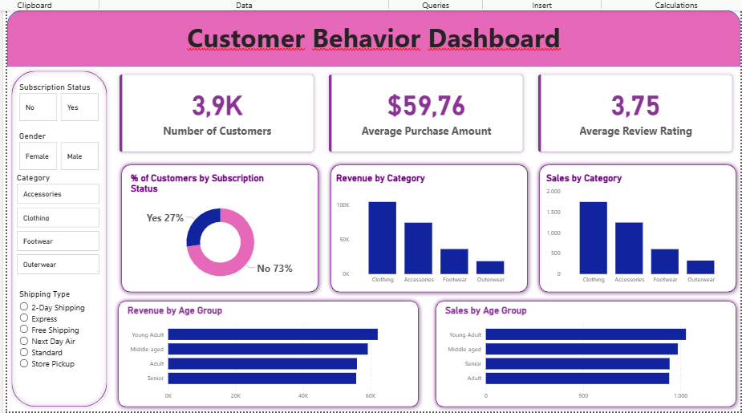

# Customer Shopping Behavior Analysis

## 📌 Project Overview

This project analyzes customer shopping behavior to identify purchasing patterns, customer segments, and key factors that influence sales and customer engagement.

The analysis uses **Python, SQL, and Power BI** to transform raw customer transaction data into actionable business insights.

The project follows an end-to-end data analytics workflow:

**Data Collection → Data Cleaning → Exploratory Data Analysis → SQL Analysis → Data Visualization → Business Insights**

---

## 🎯 Business Problem

A retail company wants to better understand its customers' shopping behavior in order to:

* Improve sales performance
* Understand customer purchasing patterns
* Identify valuable customer segments
* Analyze customer preferences
* Improve customer engagement and retention
* Support data-driven business decisions

The main business question is:

> **How can customer shopping behavior data be used to improve sales performance, customer segmentation, and customer engagement?**

---

## 🎯 Project Objectives

The objectives of this analysis are to:

1. Analyze overall customer purchasing behavior.
2. Identify high-value customer segments.
3. Analyze purchasing patterns across customer demographics.
4. Identify popular products and categories.
5. Analyze the impact of discounts and promotions.
6. Analyze customer purchase frequency and spending.
7. Develop an interactive Power BI dashboard.
8. Generate actionable business recommendations.

---

## 📊 Dataset

The dataset contains customer shopping transaction information.

Key variables include:

* Customer ID
* Age
* Gender
* Location
* Subscription Status
* Purchase Amount
* Previous Purchases
* Frequency of Purchases
* Discount Applied
* Promo Code Used
* Category
* Item Purchased
* Size
* Color
* Season
* Review Rating
* Shipping Type
* Payment Method

The dataset is used to analyze customer demographics, purchasing behavior, product performance, and customer engagement.

---

## 🛠️ Tools & Technologies

### Python

Used for:

* Data loading
* Data cleaning
* Data preprocessing
* Exploratory Data Analysis (EDA)
* Data transformation

Libraries:

* Pandas
* NumPy
* Matplotlib
* Seaborn

### SQL

Used for:

* Data aggregation
* Customer analysis
* Product analysis
* Customer segmentation
* Business question analysis

### Power BI

Used for:

* Data visualization
* KPI development
* Interactive dashboard
* Business reporting
* Business insights

---

# 🔄 Project Workflow

## 1. Data Cleaning

The raw dataset was processed to improve data quality and make it suitable for analysis.

The data cleaning process included:

* Checking missing values
* Checking duplicate records
* Handling inconsistent data
* Standardizing categorical variables
* Transforming data types
* Creating analytical columns
* Preparing the final dataset for SQL and Power BI

---

## 2. Exploratory Data Analysis

Exploratory Data Analysis was performed to understand the characteristics of the dataset.

The analysis focused on:

* Customer demographics
* Purchase behavior
* Product categories
* Purchase frequency
* Customer spending
* Discounts and promotions
* Subscription status
* Customer ratings

EDA helped identify important patterns before performing deeper SQL analysis and dashboard development.

---

# 🧮 SQL Analysis

SQL was used to answer key business questions related to customer shopping behavior.

Examples of analytical questions include:

### Customer Analysis

* Which customer segments generate the highest revenue?
* How does spending differ by gender?
* How does customer age relate to purchasing behavior?
* Do subscribed customers generate higher revenue?

### Product Analysis

* Which products generate the highest sales?
* Which product categories are most popular?
* Which products have the highest average ratings?

### Purchasing Behavior

* How frequently do customers make purchases?
* What is the average purchase amount?
* How do discounts affect purchasing behavior?
* Which payment methods are most frequently used?

---

# 📊 Power BI Dashboard

An interactive Power BI dashboard was developed to provide a comprehensive overview of customer shopping behavior.

The dashboard includes key metrics and visualizations related to:

* Total Customers
* Total Sales
* Average Purchase Amount
* Customer Segmentation
* Product Performance
* Customer Demographics
* Purchase Frequency
* Discount Usage
* Subscription Status
* Product Categories

## Dashboard Preview



> **Note:** Place your Power BI dashboard screenshot in the same folder as this README and rename the image to `dashboard.png`.

---

# 💡 Business Insights

The analysis provides several insights into customer shopping behavior.

### 1. Customer Segmentation

Customer purchasing behavior varies across different customer segments. Identifying high-value customers can help the company prioritize retention and personalized marketing strategies.

### 2. Product Performance

Some products and categories contribute more significantly to overall sales. These products can be prioritized in marketing campaigns and inventory planning.

### 3. Subscription Behavior

Subscription status can be used as an important customer segmentation variable to understand differences in purchasing frequency and spending behavior.

### 4. Discount & Promotion

Discounts and promotional campaigns can influence purchasing decisions. However, their effectiveness should be evaluated based on incremental sales and customer value rather than discount usage alone.

### 5. Customer Engagement

Purchase frequency and previous purchase behavior can be used to identify highly engaged customers and customers who may require retention strategies.

---

# 🚀 Business Recommendations

Based on the analysis, several recommendations can be proposed:

### 1. Focus on High-Value Customers

Develop personalized offers and loyalty programs for customers with high purchase frequency and high spending.

### 2. Improve Customer Retention

Use previous purchase behavior to identify customers with declining activity and target them with personalized campaigns.

### 3. Optimize Promotional Strategies

Evaluate discount campaigns based on their impact on sales, purchase frequency, and customer lifetime value.

### 4. Prioritize High-Performing Products

Increase marketing exposure and inventory availability for products and categories with strong sales performance.

### 5. Strengthen Customer Segmentation

Use demographic and behavioral variables to create more targeted marketing campaigns.

---

# 📁 Project Structure

```text
Customer-Shopping-Behavior-Analysis/
│
├── data/
│   └── customer_shopping_behavior.csv
│
├── python/
│   └── customer_shopping_behavior_analysis.ipynb
│
├── sql/
│   └── customer_shopping_behavior_analysis.sql
│
├── powerbi/
│   └── customer_shopping_behavior_dashboard.pbix
│
├── images/
│   └── dashboard.png
│
└── README.md
```

---

# 📌 Key Skills Demonstrated

This project demonstrates the following Data Analyst skills:

* Data Cleaning
* Data Preprocessing
* Exploratory Data Analysis
* SQL Querying
* Data Transformation
* Data Visualization
* Power BI Dashboard Development
* KPI Development
* Business Analysis
* Business Insight Generation
* Data-Driven Decision Making

---

# 👨‍💻 Author

**Faris Fatur Rohman**

Bachelor of Mathematics | Data Analyst

**Skills:**
Python · SQL · Excel · Power BI · Pandas · NumPy · Data Analysis · Data Cleaning · Data Visualization

### GitHub

[github.com/SubaerVernandes](https://github.com/SubaerVernandes)
